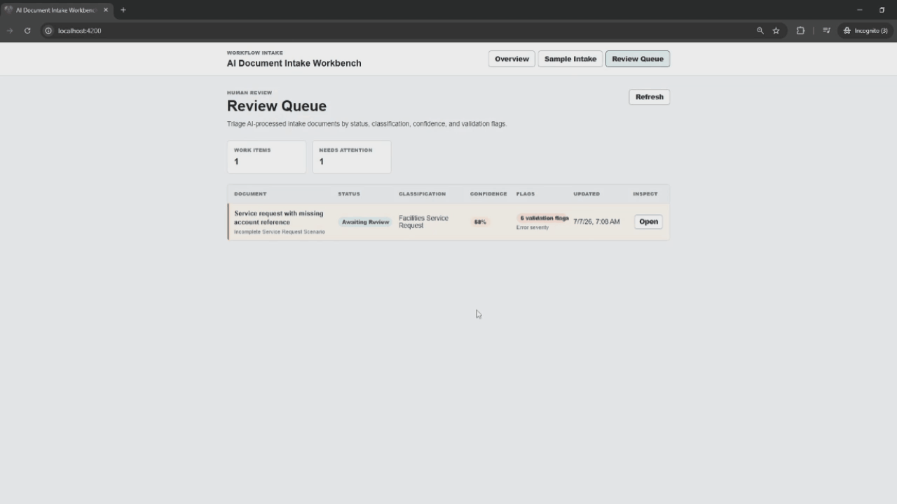

# AI Document Intake Workbench

AI Document Intake Workbench is a full-stack AI-assisted workflow application for sample document intake, structured AI processing, backend validation, validation flags, human review queue and detail screens, reviewer field edits, final reviewer decisions, workflow status tracking, and audit history. AI is assistive: it produces structured classification, extracted fields, confidence, routing, and rationale, while backend validation and human review control final outcomes.

## Demo Preview


**Full demo video:** [Watch the release walkthrough](https://github.com/sanghunmok-prog/ai-document-intake-workbench/releases/latest)


## What This Project Demonstrates

- ASP.NET Core Web API backend.
- Angular workflow UI.
- SQL Server persistence with EF Core.
- REST APIs for intake, processing, review, decision, and audit workflow screens.
- Deterministic mock AI by default.
- Optional OpenAI provider behind an AI service abstraction.
- Structured AI output for document type, extracted fields, confidence, routing, and rationale.
- Backend validation and reviewer-facing validation flags.
- Review queue and review detail workflow.
- Reviewer field edits and final decisions.
- Audit trail and workflow traceability.
- Local demo without external AI keys.

## Current Status

The MVP workflow is implemented. The default local demo uses deterministic mock AI, so local setup, automated tests, and the main click-through demo do not require external AI keys.

Optional OpenAI provider support is available only when explicitly configured. Live OpenAI provider testing is not required for the documented local demo, and this README does not claim live provider testing or production readiness.

## Tech Stack

- ASP.NET Core Web API
- C#
- EF Core
- SQL Server
- Angular
- TypeScript
- REST APIs
- Deterministic mock AI
- Optional OpenAI provider

## Repository Layout

- `AiDocumentIntakeWorkbench.sln` - solution file.
- `src/backend/AiDocumentIntakeWorkbench.Api` - ASP.NET Core Web API backend.
- `tests/backend/AiDocumentIntakeWorkbench.Api.Tests` - backend test project.
- `src/frontend/ai-document-intake-workbench-web` - Angular frontend.
- `docs` - public project specification, roadmap, and testing notes.

## Prerequisites

- WSL/Linux shell.
- Git.
- .NET 10 SDK, matching the current `net10.0` backend projects.
- Node.js and npm compatible with the Angular 21 frontend.
- Docker Desktop or another local SQL Server option.
- No external AI key is required for mock mode.

## Configuration

The backend reads configuration from standard ASP.NET Core configuration sources, including environment variables and user secrets.

Common settings:

- `ConnectionStrings__WorkbenchDb` - SQL Server connection string.
- `AiProvider__Mode=Mock` - default local demo mode.
- `AiProvider__Mode=OpenAI` - optional live provider mode.
- `OpenAI__ApiKey`: `<your-api-key>`
- `OpenAI__Model`: `<model-name>`

Do not commit real secrets. Optional OpenAI mode may incur API costs if enabled. Provider output still goes through backend validation and human review.

## Local Database Setup And Reset

The backend uses SQL Server through the `ConnectionStrings:WorkbenchDb` configuration key. The committed configuration is public-safe and does not include credentials.

Start a local SQL Server container:

```bash
read -rsp "SQL Server SA password: " SQL_SERVER_SA_PASSWORD
echo

docker run --name ai-workbench-sql \
  -e ACCEPT_EULA=Y \
  -e MSSQL_SA_PASSWORD="$SQL_SERVER_SA_PASSWORD" \
  -p 1433:1433 \
  -d mcr.microsoft.com/mssql/server:2022-latest
```

Set the backend connection string in the current shell:

```bash
SQL_CONNECTION_PREFIX="Server=localhost,1433;Database=AiDocumentIntakeWorkbench;User Id=sa;Pass"
export ConnectionStrings__WorkbenchDb="${SQL_CONNECTION_PREFIX}word=${SQL_SERVER_SA_PASSWORD};Encrypt=True;TrustServerCertificate=True"
```

Apply EF Core migrations from the repository root:

```bash
dotnet ef database update \
  --project ./src/backend/AiDocumentIntakeWorkbench.Api/AiDocumentIntakeWorkbench.Api.csproj \
  --startup-project ./src/backend/AiDocumentIntakeWorkbench.Api/AiDocumentIntakeWorkbench.Api.csproj
```

Optional cleanup/reset:

```bash
docker stop ai-workbench-sql
docker rm ai-workbench-sql
```

Then rerun the container and database update commands.

## Run Backend

From the repository root:

```bash
dotnet run --project ./src/backend/AiDocumentIntakeWorkbench.Api/AiDocumentIntakeWorkbench.Api.csproj --launch-profile http
```

The backend console prints the active local URL. With the current `http` launch profile, the API listens on `http://localhost:5080`.

Health check:

```bash
curl http://localhost:5080/health
```

## Run Frontend

From the repository root:

```bash
cd src/frontend/ai-document-intake-workbench-web
npm install
npm start
```

The Angular development server runs at `http://localhost:4200/` by default.

## Build And Test

Backend:

```bash
dotnet restore ./AiDocumentIntakeWorkbench.sln
dotnet build ./AiDocumentIntakeWorkbench.sln --no-restore
dotnet test ./AiDocumentIntakeWorkbench.sln --no-build
```

Frontend:

```bash
cd src/frontend/ai-document-intake-workbench-web
npm install
npm run build
```

No `npm test` script is currently configured. Automated tests do not require OpenAI API keys.

## Sample Scenarios

- `clean-high-confidence` - clean, high-confidence structured extraction.
- `missing-low-confidence` - missing required field and low-confidence extraction.
- `conflicting-inconsistent` - conflicting or inconsistent totals/data.

These samples are deterministic in mock mode so the local demo and tests are repeatable.

### Validation Flags Preview




## 60-90 Second Click-Through Demo

1. Start SQL Server and apply migrations.
2. Start the backend API.
3. Start the Angular frontend.
4. Open `http://localhost:4200/`.
5. Open **Sample Intake**.
6. Create a `clean-high-confidence` intake document.
7. Click **Process with Mock AI**.
8. Show the processing result: classification, confidence, validation flags, and suggested routing.
9. Click **Open Review Queue**.
10. Open the review detail screen from the queue.
11. Show source context, AI assessment, extracted fields, validation flags, and audit history.
12. Edit one reviewed field.
13. Approve the item.
14. Show final status and audit events.

The `missing-low-confidence` and `conflicting-inconsistent` samples demonstrate validation flags and human review routing concerns.

## Optional OpenAI Provider

The optional OpenAI provider is configuration-gated. The validated local demo path uses deterministic mock AI and does not require external API keys.

Mock mode:

```bash
export AiProvider__Mode=Mock
```

Optional OpenAI mode:

```bash
export AiProvider__Mode=OpenAI
export OpenAI__Model="<model-name>"
export OpenAI__ApiKey
read -rsp "OpenAI API key: " OpenAI__ApiKey
echo
```

Optional live provider use may incur API costs. Live provider output is still structured, validated by the backend, routed to human review, and subject to final reviewer decision. The documented demo path uses mock AI.

## Known Limitations

- Local demo app, not production-ready.
- Lightweight workflow without full auth.
- Sample documents only.
- No file upload or OCR.
- No broad document-management system.
- No chatbot or RAG workflow.
- Optional provider is not required for the mock demo.
- No cloud deployment infrastructure.
- No external integrations.

## Explicitly Out Of Scope

- Chatbot.
- ChatGPT clone.
- Chat with PDFs.
- Broad RAG.
- OCR platform.
- Full document-management system.
- Full claims or case-management system.
- Autonomous approvals or rejections.
- Model training or fine-tuning.
- Vector database.
- Cloud, Kubernetes, or microservices.
- External integrations.

## Final Validation Checklist

- Backend restore/build/test passes.
- Frontend install/build passes.
- Database migrations apply locally.
- Mock-mode click-through demo works from Sample Intake through Audit History.
- No secrets are committed.
- No scope creep beyond the documented workflow.
- No live provider is required for local demo or automated tests.

## Public Documentation

- [Agent Instructions](AGENTS.md)
- [Project Specification](docs/PROJECT_SPEC.md)
- [PR Roadmap](docs/PR_ROADMAP.md)
- [Testing and Validation](docs/TESTING.md)
